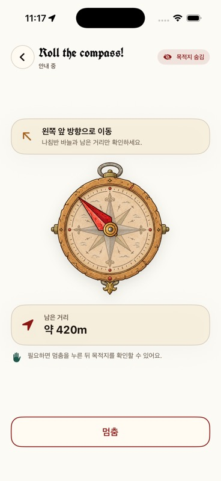
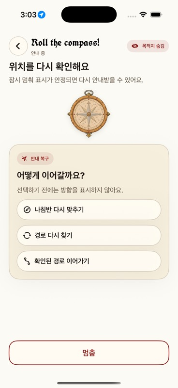

# Native iOS collaboration and Mac development handoff

Status: operational runbook for the current `Roll the compass!` native app

This page is written for both human collaborators and coding agents. It explains
what to read, where the implementation lives, and how to reproduce the app on a
Mac. It cannot override the product authority described in
[`../README.md`](../README.md).

## Start here

Read in this order:

1. root [`AGENTS.md`](../../AGENTS.md);
2. documentation authority [`../README.md`](../README.md);
3. current native requirements
   [`../product/roll-the-compass-ios-requirements.md`](../product/roll-the-compass-ios-requirements.md);
4. native source/build reference [`../../ios/README.md`](../../ios/README.md);
5. this runbook;
6. [`ios-field-release.md`](ios-field-release.md) only for signing, TestFlight,
   or physical-device evidence.

Do not treat the frozen v0.1 prototype, v0.2 web app, old prompt packs, or an
isolated wireframe branch as current native authority.

## Branch and prototype relationship

- Native baseline: `codex/v2-macos-handoff` at `8fd64d4` before this review work.
- Current native review branch: `codex/roll-compass-native-app`.
- Collaborator visual prototype: `codex/roll-the-compass-visual`, whose latest
  feedback direction is represented by `8435594` (two primary reactions plus a
  visit exception).

The visual prototype and V2 native implementation are isolated histories with
different directory and product boundaries. Do not merge the prototype branch
wholesale into V2: doing so removes the V2 iOS/backend tree. Port approved
interaction and visual decisions deliberately, then preserve native safety,
contract, and test boundaries.

## Implementation map

| Concern | Canonical location |
| --- | --- |
| App entry and launch arguments | `ios/Somewhere/App/SomewhereApp.swift` |
| Journey orchestration and UI state | `ios/Somewhere/Application/JourneyStore.swift` |
| Route/arrival guidance math | `ios/Somewhere/Domain/GuidanceEngine.swift`, `ArrivalGate.swift` |
| API contract adapter | `ios/Somewhere/Networking/APIJourneyService.swift` |
| Restaurant eligibility and food-safety gates | `server/src/provider/constraints.ts`, `server/src/api/journey-composition.ts` |
| Real and Debug sensor adapters | `ios/Somewhere/Platform/LocationController.swift`, `SimulatorHeadingReplay.swift` |
| Screen routing | `ios/Somewhere/UI/RootView.swift` |
| Launch/conditions/profile | `ConstraintView.swift`, `OnboardingView.swift`, `ProfileSettingsView.swift` |
| Active guidance | `CompassView.swift`, `SomewhereCompass.swift` |
| Arrival/reveal/recovery | `ArrivalView.swift`, `RevealView.swift`, `RecoveryView.swift` |
| Design tokens and assets | `SomewhereStyle.swift`, `ios/Somewhere/Resources/` |
| Project definition | `ios/project.yml` |
| Native tests | `ios/SomewhereTests/`, `ios/SomewhereUITests/` |
| GPS/local Worker QA | `scripts/ios/`, `scripts/release/local-v2-serve.sh` |

Edit `ios/project.yml`, not the generated `.xcodeproj`. Regenerate the project
after adding source, resource, or target files.

## Mac prerequisites

Verified development baseline:

- macOS with Xcode 26.6 selected by `xcode-select`;
- iOS 26.5 Simulator runtime;
- XcodeGen 2.42.0 or newer;
- Bun 1.3.14 and Node 24;
- Git and an authenticated GitHub account.

Check the machine before changing code:

```sh
xcode-select -p
xcodebuild -version
xcrun simctl list runtimes
xcodegen --version
bun --version
node --version
```

Expected repository versions are Bun `1.3.14`, Node `v24.x`, Swift 6, and an
iOS 17 minimum deployment target. A newer Xcode/SDK is valid local evidence but
must be recorded because it is not byte-identical to an older CI build.

## Clean-clone setup

```sh
gh repo clone kimkiumin/Somewhere Somewhere
cd Somewhere
git fetch origin
git switch --track origin/codex/roll-compass-native-app
bun install --frozen-lockfile
xcodegen generate --spec ios/project.yml
xcodebuild -list -project ios/Somewhere.xcodeproj
open ios/Somewhere.xcodeproj
```

If the review branch has not been published yet, use
`origin/codex/v2-macos-handoff` and apply the reviewed changes separately.

In Xcode, choose the shared `Somewhere` scheme, select an installed iPhone
Simulator, and press Run. Simulator builds do not require an Apple signing team.

## Fast UI/demo workflow without a backend

The checked-in `https://example.invalid` origin intentionally prevents a fake
production connection. To inspect a deterministic screen, open
**Product → Scheme → Edit Scheme → Run → Arguments** and add separate arguments:

```text
--ui-test-state
following
--ui-test-credible-guidance
--ui-test-no-notifications
```

Useful states include `following`, `arrived-rich`, `paused`, `stopped`,
`route-recovery`, and `expired`. Remove the arguments before checking the normal
launch flow. These modes compile only into Debug behavior and are not a field or
release result.

With XcodeBuildMCP, first inspect session defaults, then use:

```json
{
  "launchArgs": ["--ui-test-state", "following", "--ui-test-credible-guidance", "--ui-test-no-notifications"],
  "extraArgs": ["CODE_SIGNING_ALLOWED=NO", "SOMEWHERE_API_ORIGIN=https://example.invalid"]
}
```

## Current collaborator decisions (2026-08-20)

These decisions are intentionally explicit so another human or coding agent can
continue the work without reconstructing the discussion:

- Native discovery is restaurant-only. The old `cafe` value remains in the
  shared contract and historical fixtures so old evidence stays parseable, but
  `SomewherePreferences.normalized` always persists/submits `restaurant`.
- Dietary conditions and allergies are profile state. They are edited from the
  launch gear menu, stored locally, and copied into each create/recovery request
  at the moment a journey starts. They are not duplicated in the journey form.
- Budget is a SwiftUI `Slider`, not a wheel. Stops are 4,000원 through 50,000원
  plus `상관없음`; the native value is displayed exactly, then mapped to the
  current server `low`/`medium`/`high` compatibility band.
- The design remains deliberately editable: colors, card shape, danger action,
  reaction tiles, and primary/secondary buttons live in
  `ios/Somewhere/UI/SomewhereStyle.swift`; screen composition stays in small
  SwiftUI views rather than a screenshot or a generated canvas.
- The browser consumer surface now follows the same restaurant-only and
  stop-first reveal contract as native: an active journey exposes Stop but not
  Reveal, and the revealed name/address is rendered after a completed journey.

## Portrait exhibition handoff (2026-08-26)

Branch to review: `codex/ipad-exhibition`. Do not use
`codex/roll-compass-native-app` as the review branch for this handoff.

| Device | Role | Completion evidence |
| --- | --- | --- |
| iPad Pro (11-inch) (2nd generation) | primary portrait exhibition target | full UI matrix, screenshots, then physical install |
| iPhone 13 | secondary exhibition target | compact UI matrix, then physical install |
| Owner iPhone 15 Pro Max | development regression only | existing signed/debug evidence; not exhibition acceptance |

Primary acceptance is portrait iPad Pro (11-inch) (2nd generation). Secondary
acceptance is portrait iPhone 13. The owner iPhone 15 Pro Max is development
regression only, not exhibition acceptance. No backend, API contract,
recommendation, or persistence changes are included in this handoff. Physical
compass/BLE/ESP32 hardware integration remains a separate follow-up.

## Restaurant recommendation algorithm

The selection is not a ranking feed. The product promise is one hidden,
evidence-qualified discovery, so the algorithm uses an evidence-first pool and
an unbiased draw:

1. Canonicalize the reviewed provider bundle and remove duplicate provider place
   IDs.
2. Apply hard eligibility gates before random selection: restaurant category,
   requested budget ceiling, reviewed venue safety, active rights/quota,
   reviewed merit/evidence, a reviewed route inside the walk-time limit, and
   reviewed dietary/allergen metadata when the user has supplied those profile
   constraints.
3. Fail closed for food-safety claims. Unknown dietary or allergen metadata is
   not treated as “safe”; a constrained request returns `no_fit` until the
   venue has reviewed metadata. This is a deliberate safety boundary, not a
   temporary UI fallback.
4. Seal the remaining pool and choose with uint32 rejection sampling. The draw
   is uniform over eligible candidates, excludes the previous destination when
   a guarded replacement is allowed, and records revalidation receipts.
5. Revalidate the selected snapshot immediately before returning it. If policy
   changed, remove that member and draw again from the remaining pool.

This follows the standard candidate-generation/evidence-validation separation
used by recommender systems while preserving the hidden-destination product's
fair exposure and surprise. It intentionally avoids a hidden popularity score:
feedback can improve future evidence and curation, but it must not quietly turn
the experience into restaurant rankings.

The current Seoul Forest fixture has no reviewed dietary/allergen fields, so a
non-empty dietary or allergy profile correctly produces `no_fit` in this
fixture. Before field use, add source-backed, rights-approved metadata to the
venue bundle and its review evidence; never weaken the gate to make a demo fit.

Research anchors for future provider work:

- [Apple Slider](https://developer.apple.com/documentation/swiftui/slider) and
  [SwiftUI accessibility fundamentals](https://developer.apple.com/documentation/swiftui/accessibility-fundamentals)
  support the native control and stable assistive labels.
- [Google Places place types](https://developers.google.com/maps/documentation/places/web-service/place-types)
  and [field selection](https://developers.google.com/maps/documentation/places/web-service/choose-fields)
  are reference material only; adding a live/paid provider still requires an
  owner-approved rights, quota, field-mask, and privacy decision.
- [MFDS allergen guidance](https://www.law.go.kr/LSW/cgmExpcInfoP.do?cgmExpcDatSeq=2406627&mode=2)
  is the reason ingredient presence and cross-contamination evidence must be
  represented separately and reviewed before a safety claim.

## Verification matrix for this change set

| Area | Evidence |
| --- | --- |
| Contract | Allergy IDs parse independently; legacy payloads still parse via the default empty array. |
| Server | Medium restaurant selection remains valid; low-budget overreach and unknown allergy metadata return `no_fit`. |
| Native unit | Legacy `cafe` preference normalizes to `restaurant`; profile taxonomy remains stable. |
| Native UI | Slider identifier `somewhere.budget-slider`; profile form is absent from journey conditions; menu reaches the profile sheet; feedback exposes dislike/like plus did-not-visit. |
| Simulator | `SomewhereTests` pass; `JourneyFlowUITests` exercise launch, conditions, guidance, stop, reveal, arrival, recovery, and feedback. Network-backed virtual field tests remain opt-in when the local Worker/proxy is available. |

### Task 6 branch/device run (2026-08-26)

This is additive evidence for `codex/ipad-exhibition`; it does not overwrite
the historical matrix or earlier Worker-backed evidence above. The branch to
review is `codex/ipad-exhibition`, not `codex/roll-compass-native-app`.

| Device/run | Exact result | Evidence |
| --- | --- | --- |
| iPad Pro (11-inch) (2nd generation), final matrix run `1787671690781` | PASS; 50 total, 50 passed, 0 failed, 0 skipped; 18 PNG screenshot attachments (19 exported files including the manifest) | `.local-artifacts/ios-exhibition/1787671690781/ipad-pro-11-2nd-gen.xcresult` |
| iPhone 13, final matrix run `1787671690781` | PASS; 50 total, 49 passed, 0 failed, 1 skipped; the skip is the intentional iPad-only two-column profile assertion; 18 PNG screenshot attachments (19 exported files including the manifest) | `.local-artifacts/ios-exhibition/1787671690781/iphone-13.xcresult` |

The final matrix command exited zero. The iPad model was the exact
`iPad Pro (11-inch) (2nd generation)` on iOS 26.5, and the iPhone model was the
exact `iPhone 13` on iOS 26.5. The final run above is authoritative for this
branch. Earlier attempts are retained as diagnostics: one had a single UI
timing assertion, one had a separate UI timing assertion, and one lost the
Simulator test service with `NSMachErrorDomain -308`; no further blind matrix
run was made after the active `1787671690781` run passed.

The authoritative owner-phone regression used the named
`Somewhere Owner iPhone 15 Pro Max` Simulator on iOS 26.5. XcodeBuildMCP ran
the complete `SomewhereTests` plus `JourneyFlowUITests` selection from reusable
test products with code signing disabled: 69 total, 69 passed, 0 failed,
0 skipped, result Passed. Evidence is
`.local-artifacts/ios-exhibition/1787671690781/owner-iphone-15-pro-max-clean-rerun.xcresult`.

The earlier full run remains a superseded timing diagnostic: 69 total,
68 passed, 1 failed, 0 skipped, exit 65. Its sole failure was the
timing-sensitive
`JourneyFlowUITests/testGuardedRecoveryRequiresExplicitReview()` assertion,
and its focused retry passed 1 total, 1 passed, 0 failed, 0 skipped. The clean
69/69 rerun above is current regression evidence. All owner-phone results are
Simulator-only; they are not physical-device verification or exhibition
acceptance.

| Root command | Exit | Exact result |
| --- | ---: | --- |
| `bun run verify` | 0 | Prototype 11 passed; app unit 183 passed; browser E2E 34 passed and 3 skipped; contracts 15 passed. |
| `bun run test:server` | 0 | 65 test files passed; 238 tests passed. Expected negative-path SQLite/runtime diagnostics were emitted. |
| `bun run test:e2e:v2` | 0 | 5 real-Worker browser tests passed, 0 failed. |
| `bun run verify:blueprint` | 0 | Study 31 passed; completion 22 passed; iOS source/field tests 29 passed; native-evidence tests 14 passed. Authority output remains service slice PASS, blueprint project BLOCK, public release BLOCK for the existing external gates. |

Native source and field-flow verification also passed: 29 tests, 0 failed,
with the native source gate reporting deployment target 17, 21 projection
examples, 17 endpoints, 12 actions, and 14 required sources; the field-flow
gate reported 23 required files, 21 unit scenarios, 28 UI scenarios, and 44
minimum control points.

### Corrected Worker-backed virtual field evidence

The earlier Task 6 virtual-field conclusion was incorrect. Systematic
reproduction proved that the failures were caused by the test environment:
the app had been built against the direct self-signed
`https://127.0.0.1:8787` Worker origin, bypassing the required iOS loopback
cookie proxy, and the fresh target Simulators had not been granted location
permission. The correct Simulator app origin is
`http://127.0.0.1:8788`, with
`scripts/ios/local-ios-loopback-proxy.mjs` forwarding to the Worker on port
8787. After location was granted to the exact iPad Simulator, proxy traffic
immediately showed session `200`, journey `201`, and commit `200` responses.

The corrected XcodeBuildMCP runs used app/test products compiled with the
loopback-proxy origin, passed `SOMEWHERE_RUN_LOCAL_E2E=1` through
`testRunnerEnv`, and granted location to bundle `example.somewhere.field` on
each exact target:

| Device/run | Exact result | Evidence |
| --- | --- | --- |
| iPad Pro (11-inch) (2nd generation), location granted | PASS; 2 total, 2 passed, 0 failed, 0 skipped | `.local-artifacts/ios-exhibition/1787671690781/virtual-field-corrected/ipad-location-granted.xcresult` |
| iPhone 13, location granted | PASS; 2 total, 2 passed, 0 failed, 0 skipped | `.local-artifacts/ios-exhibition/1787671690781/virtual-field-corrected/iphone-13-location-granted.xcresult` |

The original direct-origin bundles remain useful as superseded diagnostics,
not acceptance failures: the enabled iPad run and its one allowed retry each
reported 0 passed and 2 failed, and the original iPhone run reported 0 passed
and 2 failed. Their evidence remains under
`.local-artifacts/ios-exhibition/1787671690781/virtual-field/`. No app,
backend, contract, recommendation, or persistence change was required.

Reproduce the corrected flow in this order:

1. Start the local QA Worker with `bun run local:v2:start-for-qa`; wait for the
   Worker health endpoint on port 8787.
2. In a separate process, start the loopback cookie proxy with
   `SOMEWHERE_PROXY_LOG=1 SOMEWHERE_UPSTREAM_PROTOCOL=https node
   scripts/ios/local-ios-loopback-proxy.mjs`; confirm port 8788 is listening.
3. Compile the Simulator app with
   `SOMEWHERE_API_ORIGIN=http://127.0.0.1:8788` and
   `CODE_SIGNING_ALLOWED=NO`.
4. Before testing each target, run `xcrun simctl privacy <simulator-udid>
   grant location example.somewhere.field`.
5. With XcodeBuildMCP, select that exact Simulator, pass
   `testRunnerEnv: {"SOMEWHERE_RUN_LOCAL_E2E":"1"}`, and run only
   `SomewhereUITests/VirtualFieldFlowUITests` against the correctly compiled
   test products.
6. Stop only the Worker and proxy processes started for the run, then confirm
   that neither port 8787 nor port 8788 remains open.

The primary acceptance target remains portrait iPad Pro (11-inch) (2nd
generation); secondary acceptance remains portrait iPhone 13. The owner
iPhone 15 Pro Max remains development regression only. The corrected
exact-device virtual-field suite is no longer a blocker. Physical installation,
real walking accuracy, and physical compass/BLE/ESP32 hardware integration
remain separate follow-up gates.

## Journey integrity review (2026-08-21)

The following rules are now implemented across the TypeScript contract, Worker
lifecycle, native projection decoder, SwiftUI screens, and regression tests:

- Active unrevealed projections do not expose `Reveal`; `Stop` opens the safety
  path, and Reveal is available only after a pause, stop, or completed journey.
- External-map handoff is offered only after the journey is paused or already
  revealed. Active route recovery has a visible Stop action but no direct map
  escape.
- Confirmed Stop persists `selected_member_digest`. Legacy guards that still
  carry `randomness_digest` resolve through `selection_receipts` before
  recovery eligibility is evaluated.
- Recovery removes the previous selected member before pool sealing and returns
  `no_fit` when no reviewed restaurant remains; a same-destination success is
  not a valid recovery result.
- The compass needle rotates around the measured artwork hub, not the image
  bounding-box center, and uses an unwrapped shortest-angle target so a
  `359° → 1°` change takes the two-degree path.

Final evidence from this review:

- Native source/field-flow gates: `bun run verify:ios-source` and
  `bun run verify:native-evidence` pass after the canonical fixture/count
  updates.
- Complete Debug Simulator suite on iPhone 17 Pro / iOS 26.5: 59 discovered,
  57 passed, 0 failed, 2 skipped. The skips are the two Worker-backed virtual
  field tests when no local Worker is configured.
- Worker-backed virtual field suite with the local D1 Worker and loopback
  cookie proxy: 2 passed, 0 failed, 0 skipped. It covers real session/create/
  commit, off-route suppression/recovery, multi-sample arrival, and automatic
  restaurant reveal.
- Browser consumer E2E: run `bun run --cwd app test:e2e` for the deterministic
  harness suite, or `bun run test:e2e:v2` for the real production bundle against
  the local Worker. The dedicated V2 Playwright config writes an absolute
  evidence directory so Worker startup/cleanup receipts are reproducible from
  any checkout working directory. The real browser flow asserts that the
  restaurant identity is absent during active guidance, Reveal is unavailable
  until the stop/reason path completes, and the revealed restaurant is shown
  before guarded recovery.
- The 2026-08-23 browser verification passed: deterministic consumer E2E is
  34 passed and 3 skipped (existing WebKit focus-automation limitation), while
  the real Worker E2E is 5 passed and 0 failed. The Worker run also verifies
  the guarded replacement `no_fit` screen and confirms its process, port, and
  temporary state cleanup receipts on macOS.
- JavaScript regression: app 183 passed, server 238 passed, contracts 15
  passed; all three workspaces typecheck successfully, lint has no errors, and
  `bun audit` reports no vulnerabilities.
- Final 368 × 800 visual captures are in the ignored local directory
  `.local-artifacts/audit-2026-08-21-final/`: launch, following, paused,
  route-recovery, arrived-rich, feedback, and credible-guidance heading.
- The first combined Worker run exposed one stale native assertion expecting the
  old address-hidden arrival behavior. It was corrected in
  `0c56f16`; the focused Worker suite then passed without changing runtime
  behavior.

Focused reproduction commands:

```sh
bun run verify:ios-source
bun run verify:native-evidence

# Deterministic native suite through XcodeBuildMCP
# extraArgs: CODE_SIGNING_ALLOWED=NO,
#            SOMEWHERE_API_ORIGIN=https://example.invalid

# Worker-backed native suite
bash scripts/release/local-v2-start-for-qa.sh
SOMEWHERE_PROXY_LOG=1 SOMEWHERE_UPSTREAM_PROTOCOL=https \
  node scripts/ios/local-ios-loopback-proxy.mjs
# extraArgs: CODE_SIGNING_ALLOWED=NO,
#            SOMEWHERE_API_ORIGIN=http://127.0.0.1:8788
# testRunnerEnv: {"SOMEWHERE_RUN_LOCAL_E2E":"1"}
```

This evidence does not close the external gates: Apple signing/TestFlight,
physical walking accuracy, provider rights and dietary/allergen review, legal
review, Cloudflare secrets/domains, and the Linux-only release authority gate
still require their respective owners. On macOS, `bun run verify:v2` reaches
the existing operations process tests but cannot finish their Linux-oriented
cleanup fixtures because this host has BSD `realpath` and no `setsid`; run that
gate in the repository's Ubuntu CI or Linux release environment.

## vNext collaborator compass sync (2026-08-24)

The owner approved a new collaborator-supplied shell and red needle as the
native visual source. This is a targeted visual sync, not a merge of the
unrelated visual-prototype branch. Asset source hashes and the byte-preserving
background-alpha transformation are recorded in
[`../../ios/Somewhere/Resources/README.md`](../../ios/Somewhere/Resources/README.md).

Implementation rules for future collaborators and AI agents:

- Keep the supplied shell and needle as separate assets. The needle hub is
  measured at `(628, 1000)` on the 1254 × 1254 source canvas and is translated
  to the shell center before the shared rotation container turns.
- `GuidanceReading.arrowDegrees` is a device-relative rotation, not an absolute
  north/east/south/west bearing. Visible copy therefore uses relative movement
  cues such as `앞`, `오른쪽`, and `왼쪽 앞`.
- A provider `nextStep` is labeled as a future `다음 동작`; it must not replace
  or contradict the current needle-derived direction.
- Unrevealed `following` and `near` remain non-scrolling. `ViewThatFits`
  progressively reduces the compass while preserving direction, distance,
  safety copy, and the fixed outline `멈춤` action. At accessibility text sizes,
  decorative wordmark/status copy and restaurant metadata collapse before any
  safety control does.

Fresh evidence for this sync:

- iPhone 17 Pro / iOS 26.5 complete Simulator suite: 64 discovered, 62 passed,
  0 failed, 2 skipped. The two skips are the opt-in local-Worker virtual GPS
  tests.
- iPhone 17e / iOS 26.5 focused default, future-next-step, and accessibility
  layout scenarios: 3 passed, 0 failed, 0 skipped.
- Native field-flow source gate: 8 passed, 0 failed; 27 regular UI scenarios are
  now counted in the gate.
- The 368 × 800 review capture is tracked at
  [`../assets/roll-compass-vnext-guidance-2026-08-24.jpg`](../assets/roll-compass-vnext-guidance-2026-08-24.jpg).



## Full-surface mood continuity pass (2026-08-25)

The collaborator compass is now the visual anchor across the complete native
journey without replacing the existing V2 implementation. This change is
intentionally presentation-scoped: no `app/`, `server/`, contract, selection,
session, arrival, recovery, or feedback-wire behavior was removed or replaced.

Implementation decisions:

- Active guidance keeps the approved red needle and existing live relative
  rotation. Paused, recovery, reveal-placeholder, and no-fit states reuse the
  approved shell without a needle so they never imply a direction that the app
  cannot currently justify.
- Route recovery is a fixed one-viewport safety surface rather than a scrolling
  form. Its compact accessibility layout preserves every recovery choice and
  the fixed `멈춤` control without clipped labels at large text sizes.
- Launch conditions, reveal, delayed feedback, and no-fit screens now share the
  warm parchment, burgundy, gold, serif, and Gothic wordmark language. Existing
  actions, data, and state transitions remain unchanged.
- No new map, restaurant ranking, destination preview, or unrelated illustration
  was introduced. Destination identity remains hidden until the approved reveal
  path.

Fresh verification for this pass:

- iPhone 17 Pro / iOS 26.5 complete Simulator suite: 66 discovered, 64 passed,
  0 failed, 2 skipped. The skips are the opt-in local-Worker virtual GPS tests.
- iPhone 17e / iOS 26.5 focused recovery, accessibility, no-fit, feedback, and
  condition scenarios: 5 passed, 0 failed, 0 skipped.
- Native field-flow source gate: 8 passed, 0 failed; 28 regular UI scenarios are
  counted in the gate.
- JavaScript regression: app 183 passed, server 238 passed, contracts 15 passed;
  typecheck, lint, and Blueprint verification pass.

Review captures:

- [Launch](../assets/roll-compass-vnext-home-2026-08-25.jpg)
- [Active guidance](../assets/roll-compass-vnext-following-2026-08-25.jpg)
- [Route recovery](../assets/roll-compass-vnext-route-recovery-2026-08-25.jpg)
- [Route recovery — accessibility text](../assets/roll-compass-vnext-route-recovery-accessibility-2026-08-25.jpg)
- [Arrival and reveal](../assets/roll-compass-vnext-arrival-2026-08-25.jpg)
- [Delayed feedback](../assets/roll-compass-vnext-feedback-2026-08-25.jpg)
- [No-fit recovery](../assets/roll-compass-vnext-no-fit-2026-08-25.jpg)



## Simulator build and automated tests

```sh
xcodegen generate --spec ios/project.yml

xcodebuild test \
  -project ios/Somewhere.xcodeproj \
  -scheme Somewhere \
  -destination 'platform=iOS Simulator,name=iPhone 17 Pro' \
  CODE_SIGNING_ALLOWED=NO \
  SOMEWHERE_API_ORIGIN=https://example.invalid
```

If that simulator name is unavailable, choose an available device in
`xcrun simctl list devices available` and substitute its name or UDID.

## Real local Worker and virtual GPS

Use this when the request must cross the real session/journey API instead of a
deterministic launch state.

Terminal A:

```sh
bash scripts/release/local-v2-start-for-qa.sh
```

Terminal B:

```sh
node scripts/ios/local-ios-loopback-proxy.mjs
```

In **Product → Scheme → Edit Scheme → Test → Arguments**, add the environment
variable `SOMEWHERE_RUN_LOCAL_E2E=1` for this run. Then build the app with the
loopback-only Simulator origin:

```sh
xcodebuild test \
  -project ios/Somewhere.xcodeproj \
  -scheme Somewhere \
  -destination 'platform=iOS Simulator,name=iPhone 17 Pro' \
  -only-testing:SomewhereUITests/VirtualFieldFlowUITests \
  CODE_SIGNING_ALLOWED=NO \
  SOMEWHERE_API_ORIGIN=http://127.0.0.1:8788
```

An AI agent using XcodeBuildMCP should pass
`testRunnerEnv: {"SOMEWHERE_RUN_LOCAL_E2E":"1"}` instead of editing the
scheme. The API origin is still an app build setting and must be supplied in
`extraArgs`; setting only the test-runner environment is insufficient.

Grant location permission on every fresh exact-target Simulator before the
test. Without this grant the app can launch while making no session or journey
requests:

```sh
xcrun simctl privacy <simulator-udid> grant location example.somewhere.field
```

After the suite, stop the Worker and proxy processes started for the run and
confirm that ports 8787 and 8788 are closed.

The two tests cover a real one-tap session/commit, off-route suppression and
recovery, multi-sample arrival, and automatic reveal. The proxy is loopback-only
and exists solely to adapt the local development cookie; never use it as a field
or production origin.

For manual movement after the app enters `following`:

```sh
node scripts/ios/simulate-ios-route.mjs \
  --udid <simulator-udid> \
  --candidate restaurant \
  --speed 8 \
  --interval 1 \
  --dwell 16
```

Launch the Debug app with `--simulator-heading-from-course` because Simulator
does not provide magnetometer heading. Release builds never use this fallback.

## Running on a connected iPhone

1. Connect the iPhone, trust the Mac, and enable Developer Mode on the phone.
2. In Xcode Signing & Capabilities, choose the owner's approved Team and a
   unique bundle identifier. Do not commit personal team IDs.
3. Select the connected iPhone as the run destination.
4. Build with an owner-approved HTTPS API origin reachable by the phone.
   `127.0.0.1` points to the phone itself and cannot reach the Mac Worker.
5. Accept the location permission in context and keep the app foregrounded.

A free Personal Team can install a development build on an owned phone for
short-lived testing, subject to Apple's current account/device limits. It does
not provide TestFlight or production distribution. Another collaborator should
sign with their own authorized team or use an owner-provided TestFlight build;
never share certificates or private keys through Git.

The exact command-line signing and Debug field-replay commands are maintained in
[`../../ios/README.md`](../../ios/README.md). The evidence requirements are in
[`ios-field-release.md`](ios-field-release.md).

## Repository verification before handoff

Run from the repository root:

```sh
bun run test:app
bun run test:server
bun run test:contracts
bun run typecheck
bun run lint
bun run verify:blueprint
bun run verify:release-authority
bun audit
git diff --check
```

Run the native Xcode tests on macOS as shown above. `verify:release` contains
Linux-specific operational gates and should run in the repository's Ubuntu CI,
not be treated as a Mac prerequisite.

## Contribution rules for humans and agents

- Preserve hidden destination identity before the allowed reveal path.
- Never add a map, candidate list, Reroll, direct-destination bearing fallback,
  or background-navigation promise without a newer owner decision.
- Keep Release sensor behavior real; deterministic movement and heading stay
  Debug-only.
- Keep API, domain math, orchestration, and SwiftUI view responsibilities in
  their existing layers.
- Add a regression test before changing journey transitions, sensor confidence,
  disclosure, or arrival behavior.
- Do not commit `.xcodeproj`, DerivedData, archives, result bundles, credentials,
  signing files, raw field traces, or `demo-artifacts/`.
- Do not merge the isolated visual prototype branch wholesale.
- Update the native requirements when an owner decision changes visible product
  behavior; update this runbook when the build/test procedure changes.

## Copyable AI handoff context

```text
You are working on the native iPhone app for Roll the compass! in the Somewhere
repository. Read AGENTS.md, docs/README.md,
docs/product/roll-the-compass-ios-requirements.md, ios/README.md, and
docs/operations/native-ios-collaboration-handoff.md in that order. Treat the
v0.1 prototype and v0.2 web app as historical evidence. Preserve the native
SwiftUI/Core Location architecture, hidden-destination boundary, immediate Stop,
multi-sample arrival, and Debug/Release sensor separation. Edit ios/project.yml,
not the generated Xcode project. Do not merge the isolated visual prototype
branch wholesale. Run the relevant Bun tests and Xcode Simulator tests before
claiming completion, and report external signing/field/legal gates separately.
```

## End-of-session handoff

Record the branch, commit, Xcode version, Simulator/runtime, tests run, and any
external blocker. Leave the tree free of generated projects and private evidence,
push to a review branch, and use a Draft PR as the shared context record.
