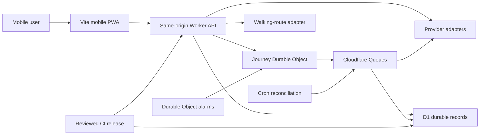

# Somewhere V2 Mobile Service Design

Status: approved direction, implementation-design candidate pending written-spec review
Date: 2026-07-29
Product surface: mobile web on iPhone first, native iOS and physical compass at later blueprint gates
Architecture: Cloudflare modular monolith with a same-origin mobile client and API

## 1. Purpose and authority

This document converts the approved Somewhere V2 product blueprint into a decision-complete implementation design for the first working mobile service and backend.

The source priority for this design is:

1. the owner's latest direction: complete the mobile service and real backend without adding tablet or desktop product scope;
2. the repository-local [`BLUEPRINT.md`](../../../BLUEPRINT.md) and linked [`docs/blueprint/`](../../blueprint/) documents, imported byte-for-byte from approved Git commit `1cd08b3`, dated 2026-07-21; these are the authoritative approved V2 product direction;
3. this design for implementation details that do not conflict with the blueprint;
4. the current v0.2 sensor PWA as implementation evidence, not as the V2 product contract;
5. current official platform documentation and the research record listed in [Section 25](#25-evidence-and-source-record).

Import provenance, source blob IDs, and SHA-256 values are recorded in [`docs/blueprint/SOURCE_RECEIPT.md`](../../blueprint/SOURCE_RECEIPT.md). Copying those objects into this lineage does not merge the sibling history.

The repository baseline inspected for this design is commit `84359bd343692f8d12da0ebe955b6ffad34b46d5`. The working tree already contains unrelated v0.2 audit and refactor changes. This design does not authorize resetting, staging, or rewriting those changes.

This document supersedes the active product behavior of the current v0.2 prototype where the two conflict. In particular, the V2 flow does not expose the current active Reroll control and does not ship a complete destination catalog to the client.

## 2. Decision summary

Somewhere V2 will:

- accept only non-negotiable restaurant or cafe constraints;
- construct a versioned, evidence-qualified pool of canonical venues;
- select exactly one venue uniformly from the frozen qualified pool;
- keep the selected venue's identity server-side until the user reveals it;
- show only policy-safe distance, representative menu/category, and price information before reveal;
- require an explicit commitment before navigation;
- guide with walking-route geometry and trustworthy sensor state, never a silent straight-line fallback;
- allow Reveal at any time without ending guidance;
- pause guidance immediately when Stop is first pressed;
- offer guarded recovery after an ended journey instead of active Reroll;
- detect arrival using route, accuracy, repetition, and dwell evidence;
- ask for one delayed place reaction;
- keep exact device location and raw field diagnostics on the device by default.

The first executable architecture will use:

- the current Vanilla TypeScript and Vite PWA as the first real iPhone client;
- a Cloudflare Worker serving both static assets and same-origin `/api/v1`;
- D1 for durable catalog, evidence, policy, receipt, consent, feedback, and audit records;
- one Durable Object for each active journey;
- Queues for idempotent asynchronous ingestion and evidence work;
- Durable Object alarms for journey expiry and delayed feedback;
- Cron only for approximate reconciliation and data-refresh sweeps.

The backend will begin with a manually verified pilot provider. No unverified commercial provider or LLM output is required to make the first integrated service work.

## 3. Product contract

### 3.1 Core promise

> 사용자가 정한 최소 조건 안에서 갈 만한 장소 하나를 빠르게 확정해, 여러 후보를 비교하지 않고 출발하게 한다.

The service does not claim to find the objectively best venue. It claims that one venue was selected uniformly from a frozen provider-retrieved pool that passed a recorded evidence policy.

### 3.2 Initial validation context

- Primary validation category: restaurant and cafe, analyzed separately.
- Primary study unit: a pair of close participants making one shared decision.
- Supported product audience: not permanently restricted by party size.
- Primary physical target for this implementation: iPhone 15 Pro Max.
- Other modern phone sizes must remain usable, but tablet and desktop layouts are not product surfaces.

A wide browser may center a phone-sized development preview. It must not introduce desktop navigation, sidebars, multi-column discovery, or tablet-specific interaction.

### 3.3 User inputs

The baseline flow accepts only high-cost failure conditions:

- restaurant or cafe;
- maximum walking distance or time;
- budget band;
- dietary restriction;
- accessibility requirement;
- another versioned hard condition that has a reliable evidence policy.

Opening status, route feasibility, evidence freshness, and provider validity are system checks. They are not badges that ask the user to interpret whether a recommendation is safe.

### 3.4 Pre-reveal disclosure

The standard first-use disclosure contains:

- route-derived distance or time;
- one representative menu category, with a second only when reliable;
- price band.

Always hidden by default:

- venue name;
- exact address;
- provider place identifier;
- exact map position;
- photos;
- reviews and ratings;
- distinctive copy or menu names that trivially identify the venue;
- the qualified candidate pool and selection receipt.

Distinctive source text must be normalized to a supported broad dish or venue category. If that cannot be done faithfully, the broad venue category is shown.

### 3.5 Explicit non-goals

- candidate lists, rankings, swiping, or comparison cards;
- active, immediate, or unlimited Reroll;
- a visible map as the primary movement interface;
- full turn-by-turn map navigation;
- a chat interface as the primary product;
- unsupported LLM-generated place facts;
- mandatory accounts for the pilot;
- reviews, ratings, popularity lists, payments, reservations, coupons, community, or social features;
- tablet and desktop product variants;
- Android implementation in this slice;
- claims that browser GPS proves a user's physical presence;
- claims that a hidden endpoint is cryptographically secret from a compromised client;
- claims that the Ubuntu implementation completes native iOS signing or physical hardware validation.

## 4. Reconciliation with the current v0.2

| Current v0.2 behavior | V2 decision |
| --- | --- |
| Static curated destinations bundled into the browser | Server-owned provider snapshot, frozen pool, receipt, and hidden journey |
| Identity hidden only by UI projection | Name, address, provider ID, standalone endpoint field, and pool never sent before reveal; committed route geometry remains inferable |
| Active Reroll action | Stop, confirmed end, reason-aware recovery, and a five-minute new-recommendation rule |
| Straight destination bearing | Walking-route geometry with route-confidence gates |
| Client-authoritative journey state | Durable Object-authoritative mutable journey |
| GitHub Pages as the production runtime | Same-origin Cloudflare static assets and Worker API |
| PWA sensor prototype | First complete mobile client, preserving proven sensor boundaries |
| Generic tablet/desktop responsive notes | Phone-only product; wide layouts are development containment only |
| Visible diagnostic scaffolding | Separate field entry point; consumer journey stays quiet |
| Test-harness build mode | Retained for deterministic E2E and never deployed to production |

The v0.2 pure geo, signal, arrival, visibility, Wake Lock, compass animation, diagnostic, offline-shell, and deterministic test boundaries remain reusable. Its destination service, Reroll contract, and client-side reveal authority do not.

## 5. System architecture



### 5.1 Responsibility boundaries

#### Mobile PWA

- collects and validates user constraints;
- requests browser permissions from a direct user action;
- sends a journey request and renders only the returned disclosure;
- processes location, heading, route progress, and arrival evidence locally;
- suppresses directional claims when confidence is insufficient;
- exposes Reveal and Stop at all required times;
- stores only short-lived active route state and disclosed local preferences;
- never contains provider secrets, the candidate pool, selection receipt, or unrevealed venue identity.

#### Worker API

- validates request schema, origin, CSRF token, rate limits, and body size;
- orchestrates catalog, policy, selection, journey, route, feedback, and privacy modules;
- creates opaque sessions and safe response projections;
- calls providers through allowlisted server-side adapters;
- returns stable typed error envelopes;
- emits redacted operational events.

#### D1

- stores canonical venue and evidence records;
- stores versioned hard-filter, disclosure, freshness, stop-reason, and merit policies;
- stores immutable frozen pools and selection receipts;
- stores consent, feedback eligibility, place reaction, and redacted audit records;
- stores outbox and inbox records for idempotent asynchronous work;
- does not store raw user location history or raw field diagnostics.

#### Journey Durable Object

- owns one active journey aggregate;
- serializes Commit, Reveal, Stop, Continue, Confirm stop, route recovery, arrival, and expiry transitions;
- binds the opaque journey identifier to the browser session;
- stores idempotency outcomes and a monotonic transition sequence;
- holds the selected destination snapshot and short-lived route state;
- schedules expiry and feedback alarms;
- prevents concurrent requests from resuming guidance after a confirmed Stop.

#### Queue workers

- ingest provider snapshots;
- normalize, canonicalize, enrich, and validate evidence;
- handle idempotent outbox delivery;
- process delayed audit or feedback-index updates;
- move poison messages to a dead-letter path without silently qualifying a venue.

#### Cron

- requests approximate refresh and reconciliation work;
- expires abandoned prepared pools and receipts;
- checks outbox/inbox and feedback-index consistency;
- never controls a user-visible real-time journey transition.

### 5.2 Why this architecture

The design selects a modular monolith because the product requires strong module boundaries but not independent deployment or scaling of each feature. Durable Objects match the one-journey consistency aggregate. D1 and Queues minimize idle operations while keeping durable records auditable.

The system must not pretend D1 and a Durable Object share a distributed transaction. Cross-store work uses prepared records, idempotent finalization, an outbox/inbox pattern, and reconciliation.

## 6. Target repository shape

```text
Somewhere/
├─ prototype/                         # historical v0.1, frozen
├─ app/                               # existing phone PWA
│  ├─ src/
│  │  ├─ domain/
│  │  ├─ application/
│  │  ├─ platform/
│  │  │  ├─ browser/
│  │  │  └─ api/
│  │  ├─ ui/
│  │  └─ testkit/
│  ├─ field.html                      # real-sensor field entry
│  └─ vite.config.ts
├─ contracts/                         # transport-only TypeScript package
│  ├─ src/
│  │  ├─ journeys.ts
│  │  ├─ feedback.ts
│  │  ├─ errors.ts
│  │  └─ index.ts
│  └─ package.json
├─ server/
│  ├─ migrations/
│  ├─ src/
│  │  ├─ api/
│  │  ├─ catalog/
│  │  ├─ evidence/
│  │  ├─ policy/
│  │  ├─ selection/
│  │  ├─ journey/
│  │  ├─ route/
│  │  ├─ feedback/
│  │  ├─ privacy/
│  │  ├─ audit/
│  │  ├─ providers/
│  │  └─ testkit/
│  ├─ package.json
│  ├─ tsconfig.json
│  └─ wrangler.jsonc
└─ package.json                        # private Bun workspace; no root type field
```

The root workspace package has no `"type"` field, preserving the historical CommonJS prototype boundary. `app`, `contracts`, and `server` each own their module type and strict TypeScript configuration.

`contracts` contains only versioned wire schemas, codecs, and transport types. It must not import browser APIs, Cloudflare bindings, D1 types, or product-domain implementations. The app and server both validate at runtime from the same schema package.

The Cloudflare Worker serves the already-built `app/dist` directory as static assets and handles `/api/v1/*`. Local development runs the Worker and assets through the Cloudflare development runtime rather than mocking API behavior in the consumer app.

## 7. Trust boundaries and assets

| Asset | Authoritative owner | Rule |
| --- | --- | --- |
| Unrevealed venue identity and explicit endpoint field | Journey Durable Object | Identity and a standalone endpoint field are never included before reveal; committed route geometry can make the endpoint inferable |
| Exact current device position | Mobile client | Used locally; not persisted or logged by default |
| Route geometry | Active client and short-lived journey state | No service-worker cache; expires with the journey |
| User constraints | Active journey and short-lived request processing | Store only what is required to enforce the journey |
| Canonical venue and evidence | D1 | Versioned provenance, freshness, and review state |
| Qualified pool and receipt | D1 | Immutable after sealing; never sent to the user |
| Mutable journey phase | Journey Durable Object | Serialized, sequence-checked, idempotent |
| Consent and deletion status | D1 | Append-only ledger plus current projection |
| Raw field diagnostics | Mobile client | Memory-only until explicit local export |
| Provider and deploy keys | Cloudflare secrets and protected CI | Never shipped, logged, or stored in D1 |

The concealment promise is product-level minimal disclosure. Route geometry can make an endpoint technically inferable. The product must not describe this as cryptographic secrecy.

## 8. Provider and evidence pipeline

```text
provider search
→ strict adapter validation
→ normalized candidate
→ canonical venue resolution
→ deterministic hard filters
→ evidence enrichment
→ structured merit interpretation
→ deterministic evidence validator
→ immutable qualified pool
→ uniform draw
→ final revalidation
→ hidden journey initialization
```

### 8.1 Provider interface

Every place provider implements:

```ts
interface PlaceProvider {
  readonly id: string;
  readonly capabilityVersion: string;
  search(input: ProviderSearchInput): Promise<ProviderSearchResult>;
  refresh(placeRef: ProviderPlaceRef): Promise<ProviderPlaceSnapshot>;
}
```

Every walking-route provider implements:

```ts
interface WalkingRouteProvider {
  readonly id: string;
  readonly capabilityVersion: string;
  route(input: WalkingRouteInput): Promise<WalkingRouteResult>;
}
```

Adapters must:

- use only allowlisted HTTPS origins;
- keep credentials in server secrets;
- enforce timeout, response-size, and response-schema limits;
- map vendor fields to a common schema without leaking vendor semantics into product policy;
- expose provenance, retrieval time, capability version, and rights policy;
- distinguish absent, unknown, conflicting, stale, and unsupported fields;
- never infer that an absent optional field is false.

### 8.2 Manually verified pilot adapter

The initial working service uses a reviewed repository dataset as a provider adapter. Each record includes source provenance, verification time, rights note, category, branch identity, location, route-test status, and only the facts allowed by the pilot evidence policy.

This adapter is not described as live market coverage. It enables an actual end-to-end backend and field journey without Google Places cost or an unverified Korean provider contract.

A commercial adapter can become active only after its capability, storage, attribution, quota, pricing, freshness, and walking-route rights are documented and represented in automated contract fixtures.

Public Nominatim is not a production discovery provider.

#### Pilot walking-route adapter

Until a lawful live walking-route contract is active, the manual pilot supports only versioned supervised routes inside explicitly approved field polygons.

Each fixture contains:

- fixture and schema version;
- approved polygon and start anchor;
- maximum origin offset, initially 50 meters;
- destination reference held server-side;
- source and rights note;
- captured and independently reviewed times;
- walkable encoded polyline, length, expected duration, and corridor width;
- endpoint and route digest;
- observed obstruction and accessibility notes;
- field-validation result and verifier;
- expiry, initially the earlier of 30 days or a recorded material street/venue change.

The adapter selects a fixture only when the measured origin and accuracy place the user within its approved start tolerance and the fixture is current. It may trim the beginning of the reviewed route only within that tolerance; it never synthesizes a connection across an unverified street segment. Outside a supported polygon, after expiry, or after a material mismatch it returns `route_unavailable`.

This is a real but bounded supervised pilot route, not general walking navigation. Production expansion requires a live provider or newly reviewed fixtures for every supported origin/destination pair. A fixture passes field acceptance only after the real iPhone route test confirms its corridor, bearing changes, expiry behavior, and safe failure path.

### 8.3 Canonicalization

Canonicalization uses:

1. provider identifiers where contractually stable;
2. normalized branch name;
3. normalized address;
4. coordinate proximity;
5. source provenance and branch evidence.

Different branches of one chain remain separate. Uncertain matches remain separate or are excluded; they are never silently merged.

The canonicalization algorithm and thresholds are versioned. A source change creates a new snapshot rather than mutating the evidence behind a sealed pool.

### 8.4 Hard filters

Hard filters are deterministic:

- category;
- maximum walking distance or time;
- budget;
- predicted opening status with an entry buffer;
- dietary restriction;
- accessibility requirement;
- route feasibility;
- explicit safety exclusion;
- evidence provenance and freshness.

Straight-line distance is only a coarse search prefilter. Final distance and time use a valid walking route.

If a high-consequence condition cannot be proven by a current accepted source, the result is `no_fit`, a supervised manually verified path, or necessary disclosure before commitment. The system never labels unknown evidence as passed.

### 8.5 Merit interpretation

LLM merit interpretation is behind a server feature flag and is off by default. The initial service uses manually adjudicated merit evidence and deterministic validation.

When enabled, the model may return only structured interpretation:

```json
{
  "candidateId": "canonical-id",
  "merits": [
    {
      "type": "menu",
      "claim": "broad source-supported category",
      "evidenceIds": ["evidence-id"],
      "confidence": "high"
    }
  ],
  "criticalWeaknesses": [],
  "unknowns": [],
  "verdict": "pass"
}
```

The deterministic validator rejects malformed output, unsupported claims, stale evidence, conflicting required facts, and low-confidence support for a hard condition. `insufficient_evidence` never becomes `pass`.

Live LLM qualification requires a frozen human-adjudicated benchmark, frozen prompt/model/policy versions, zero accepted critical-condition false passes in the release set, and an explicit rollback to deterministic/manual qualification.

### 8.6 Frozen pool and uniform selection

A pool is built with a unique builder identifier and remains `building` until:

- all members reference canonical candidates and evidence snapshots;
- every member passed one policy version;
- the ordered member list and digest are recorded;
- the pool is sealed.

Only sealed pools are selectable. Failed or abandoned builders are ignored and later expired.

Selection uses `crypto.getRandomValues` with rejection sampling to avoid modulo bias. The receipt records:

- request ID;
- provider, query, pagination, and coverage versions;
- snapshot time;
- canonicalization, rule, evidence, disclosure, model, and prompt versions;
- qualified pool size;
- ordered member-set digest;
- RNG algorithm/version;
- append-only draw attempts;
- final validation result and selected attempt.

Selection proceeds as follows:

1. Copy the sealed pool's ordered members into an ordered remaining set.
2. Record the remaining-set digest.
3. Draw an unbiased index using `crypto.getRandomValues` and rejection sampling.
4. Append an attempt with its attempt number, remaining-set digest, random bytes or normalized value, RNG version, selected index, internal candidate reference, and validation-snapshot version.
5. Revalidate the drawn candidate.
6. Append the validation outcome and a stable rejection code.
7. On rejection, remove that candidate from the ordered remaining set and repeat.
8. On success, seal the receipt with the successful attempt number.
9. If the remaining set becomes empty, seal the receipt as `no_fit`.

Each attempt's draw is persisted before external revalidation. Recovery after a crash resumes validation of that recorded candidate instead of drawing again. Attempt rows are append-only; a completed validation result cannot be overwritten. The sequence is auditable and preserves a uniform draw from each remaining set without introducing a ranking.

## 9. Durable data model

### 9.1 D1 tables

| Table | Purpose | Retention |
| --- | --- | --- |
| `field_areas` | Approved pilot polygons and provider capability | Versioned until retired |
| `provider_snapshots` | Immutable source response metadata and allowed normalized facts | Per provider rights policy |
| `canonical_venues` | Canonical branch identity and current lifecycle state | While provider rights permit |
| `venue_sources` | Provider-to-canonical provenance links | Same as source record |
| `place_evidence` | Versioned facts, provenance, timestamp, confidence, review state | Per evidence policy |
| `merit_evaluations` | Manual/deterministic/model evaluation with version references | Audit retention |
| `policy_versions` | Hard filter, freshness, disclosure, stop reason, and merit policies | Immutable |
| `qualified_pools` | Building/sealed/expired pool metadata and digest | Pilot audit retention |
| `qualified_pool_members` | Ordered immutable canonical/evidence references | Same as pool |
| `selection_receipts` | Prepared/activated/invalidated selection proof | Pilot audit retention |
| `selection_attempts` | Append-only draw, remaining-set digest, candidate, and final-revalidation result per receipt | Same as receipt |
| `route_metadata` | Provider/version/expiry/digest, without user origin history | Short operational retention |
| `browser_session_guards` | Rotating binding digest, active journey, recent stop, and one-time recovery capability state | 24 hours from last activity |
| `consent_ledger` | Versioned consent grants and withdrawals | Legal policy |
| `feedback_eligibility` | Journey-scoped capability digest, due/expiry, and one-time state for delayed reaction | Until resolved or expired |
| `place_reactions` | Separately consented, minimized reaction without venue, journey, route, or location identity | Product policy |
| `audit_events` | Redacted policy, migration, kill-switch, and integrity events | Security policy |
| `outbox_events` | Pending cross-store work | Until acknowledged plus short audit window |
| `inbox_events` | Queue deduplication keys and outcome | Queue replay window |

No table introduces a stable cross-session device identifier. Anonymous product use relies on a rotating, session-scoped browser binding. Product-improvement analytics remain disabled by default.

### 9.2 Journey Durable Object state

```ts
type JourneyBase = {
  contractVersion: 1;
  journeyId: string;
  browserBindingDigest: string;
  sequence: number;
  expiresAt: number;
  idempotency: Record<string, StoredOutcome>;
};

type FindingJourney = JourneyBase & {
  phase: "finding";
  requestId: string;
  poolBuilderRef: string;
  findingStartedAt: number;
};

type SelectedJourney = JourneyBase & {
  phase:
    | "ready"
    | "committed"
    | "following"
    | "route-recovery"
    | "near"
    | "arrived"
    | "paused"
    | "stopped"
    | "completed"
    | "expired";
  revealed: boolean;
  selectionReceiptId: string;
  selectedDestination: SelectedDestinationSnapshot;
  disclosure: SafeDisclosure;
  route?: ShortLivedRouteSnapshot;
  phaseBeforePause?: "ready" | "committed" | "following" | "route-recovery" | "near";
  stop?: ConfirmedStop;
  feedback?: FeedbackState;
  activationOutbox?: {
    eventId: string;
    receiptId: string;
    receiptDigest: string;
    status: "pending" | "acknowledged";
    attempts: number;
    nextAttemptAt: number;
    expiresAt: number;
  };
};

type JourneySession = FindingJourney | SelectedJourney;
```

The destination snapshot contains the minimum immutable facts required for one journey. It is not a mutable copy of the whole canonical catalog.

Idempotency outcomes have bounded count and TTL. The object rejects a stale `expectedSequence`, returns the existing result for a repeated idempotency key and body digest, and rejects key reuse with a different body.

## 10. Journey state model

`revealed` is an orthogonal flag. Revealing a destination does not end or pause guidance.

```text
finding
  ├─ qualified → ready
  ├─ no fit → terminal response
  └─ provider/policy failure → terminal safe error

ready
  ├─ commit → committed
  ├─ reveal → ready + revealed
  ├─ stop request → paused
  └─ expiry → expired

committed
  ├─ route ready → following
  ├─ reveal → committed + revealed
  ├─ stop request → paused
  └─ route failure → route-recovery

following
  ├─ near evidence → near
  ├─ reveal → following + revealed
  ├─ stop request → paused
  ├─ confidence failure → route-recovery
  └─ expiry → expired

route-recovery
  ├─ trusted route restored → following
  ├─ reveal → route-recovery + revealed
  └─ stop request → paused

near
  ├─ arrival evidence → arrived
  ├─ route hysteresis exit → following
  ├─ reveal → near + revealed
  └─ stop request → paused

paused
  ├─ continue → previous active phase
  ├─ technical route repair → paused with updated non-directional repair state
  ├─ reveal → paused + revealed
  └─ confirm stop → stopped

stopped
  ├─ reveal → stopped + revealed
  └─ record/skip reason → completed

arrived
  ├─ reveal → arrived + revealed
  └─ feedback alarm → feedback eligible

completed
  ├─ reveal → completed + revealed
  └─ new recommendation request → guarded recovery flow
```

Rules:

- the first Stop request is valid from `ready` and every active guidance phase and suppresses all directional output before the confirmation is rendered;
- Continue resumes only the same journey and its previous active phase;
- Confirm stop cannot be undone;
- stop reason is requested after confirmation, is skippable, and never blocks exit;
- a safety stop never auto-resumes, auto-reroutes, or auto-opens a map;
- the five-minute rule applies only to a new recommendation after an ended journey;
- a recovery request creates a new journey and selection receipt; it never mutates the old destination into another one;
- arrival is a latch and does not reverse;
- expired journeys fail closed and cannot be revived by a replayed request.

## 11. HTTP API contract

All endpoints are under `/api/v1`. JSON uses explicit versioned schemas. Successful mutation responses include `journeyId`, `sequence`, and the current safe projection.

### 11.1 Session and request controls

- `HttpOnly`, `Secure`, `SameSite=Strict` session cookie;
- opaque 128-bit-or-stronger journey identifier;
- browser session binding checked in addition to the path identifier;
- `Origin` and `Host` allowlist;
- synchronizer CSRF token returned only to the same-origin client and sent in `X-CSRF-Token`;
- `Idempotency-Key` required for every mutation;
- `Expected-Journey-Sequence` required after journey creation;
- strict content type, body limit, runtime schema, and unknown-field rejection;
- no wildcard CORS;
- rate limiting at the edge plus authoritative active-session and provider-budget limits.

### 11.2 Wire projections and mutation envelopes

Every response validates against the versioned runtime schemas in `contracts/src/journey.ts`. Optional fields are forbidden when their phase does not permit them. `revealed:false` forbids identity and `revealed:true` requires it.

| Phase/variant | Exact actions |
| --- | --- |
| `finding` | `["poll","cancel"]` |
| `ready/R0`, `ready/R1` | `["commit","reveal","stop"]`, `["commit","stop"]` |
| `committed/R0`, `committed/R1` | `["poll","reveal","stop"]`, `["poll","stop"]` |
| `following/R0`, `following/R1` | `["reveal","stop","route-recover","arrival"]`, `["stop","route-recover","arrival"]` |
| `route-recovery/R0`, `route-recovery/R1` | `["reveal","stop","route-recover"]`, `["stop","route-recover"]` |
| `near/R0`, `near/R1` | `["reveal","stop","route-recover","arrival"]`, `["stop","route-recover","arrival"]` |
| `paused/R0`, `paused/R1` | `["continue","route-recover","confirm-stop","reveal"]`, `["continue","route-recover","confirm-stop"]` |
| `stopped/R0`, `stopped/R1` | `["record-reason","skip-reason","reveal"]`, `["record-reason","skip-reason"]` |
| `completed/recovery/R0`, `completed/recovery/R1` | `["reveal","recovery"]`, `["recovery"]` |
| `completed/no-recovery/R0`, `completed/no-recovery/R1` | `["reveal"]`, `[]` |
| `arrived/R0`, `arrived/R1` | `["reveal"]`, `[]` |
| `expired` | `[]` |

Finding `cancel` invokes authenticated `DELETE /journeys/:journeyId`; it is not the paused journey's Continue action. Arrived exposes only the server Reveal action. Done is a client-local dismissal and never appears in a projection or endpoint.

```ts

type SafeDisclosure = {
  routeDistanceM: number;
  routeDurationMinutes: number;
  representativeCategories: [string] | [string, string];
  priceBand: "low" | "medium" | "high" | "unknown";
  policyVersion: string;
};

type RevealedIdentity = {
  name: string;
  address: string;
};

type RouteGuidance = {
  kind: "route";
  encodedPolyline: string;
  routeDigest: string;
  routeVersion: string;
  expiresAt: number;
};

type GuidanceUnavailable = {
  kind: "unavailable";
  reason: "route-stale" | "location-poor" | "heading-poor" | "hidden" | "provider";
};

type JourneyMutationResponse = {
  result: JourneyProjection;
  requestId: string;
};

type ArrivalMutationResponse = {
  result: Extract<JourneyProjection, { phase: "arrived" }>;
  requestId: string;
  feedbackCapability: string;
};
```

`RouteGuidance` has no standalone destination coordinate. Its terminal polyline coordinate is inferable as documented in [Section 13.1](#131-route-aware-guidance).

For every selected projection, `revealed=false` forbids the `reveal` field and `revealed=true` requires it. The `actions` array is computed from the exact phase and policy and cannot advertise an action that the transition table rejects.

The raw feedback capability appears only in the original or byte-equivalent idempotent arrival mutation response. A later journey GET never returns it.

All no-argument POST actions still send `{ "contractVersion": 1 }`. Typed mutation bodies are:

```ts
type JourneyConstraints = {
  category: "restaurant" | "cafe";
  maxWalkMinutes: number;
  budgetBand: "low" | "medium" | "high";
  dietary: string[];
  accessibility: string[];
};

type JourneyCreateBody = {
  contractVersion: 1;
  constraints: JourneyConstraints;
  origin: {
    latitude: number;
    longitude: number;
    accuracyM: number;
    capturedAt: number;
  };
  disclosureLevel: "standard";
  recoveryCapability: string | null;
};

type StopReasonBody = {
  contractVersion: 1;
  reason:
    | "safety-concern"
    | "route-or-sensor"
    | "hard-condition"
    | "venue-situation"
    | "changed-mind"
    | "schedule-changed"
    | "skip";
  reasonPolicyVersion: string;
};

type RouteRecoveryBody = {
  contractVersion: 1;
  choice: "recalibrate" | "reroute" | "cached-route" | "external-map";
};

type ArrivalBody = {
  contractVersion: 1;
  endpointDistanceBand: "outside" | "near" | "within-arrival-threshold";
  accuracyBand: "poor" | "acceptable" | "good";
  consecutiveSamples: number;
  dwellMs: number;
  routeConsistency: "unknown" | "inconsistent" | "consistent";
};

type ReactionBody = {
  contractVersion: 1;
  reaction: "dislike" | "like" | "love" | "did_not_visit";
};

type RecoveryConfirmationBody = {
  contractVersion: 1;
  recoveryIntentId: string;
  reviewedFields: string[];
  constraints: JourneyConstraints;
};
```

The string arrays in `JourneyConstraints` contain only identifiers from the current public constraint-policy schema; arbitrary free text and unknown identifiers are rejected.

Success status is `200` for mutation and read endpoints, `201` for a ready journey or issued recovery intent, `202` for a finding journey, and `204` for completed deletion. Schema/policy rejection is `422`, state or sequence conflict is `409`, expiry is `410`, rate limit is `429`, and unavailable provider/route service is `503`.

A replay with the same idempotency key and body digest returns the original status and byte-equivalent JSON with `Idempotent-Replayed: true`. Reuse of the key with a different digest returns `409 idempotency_conflict`. Every response, including errors, uses `Cache-Control: no-store, private`.

### 11.3 Endpoints

| Endpoint | Body or capability | Success |
| --- | --- | --- |
| `GET /session` | None | `200 { contractVersion, csrfToken, sessionExpiresAt }` |
| `POST /journeys` | `JourneyCreateBody` | `201 ready` or `202 finding` projection |
| `GET /journeys/:id` | None | `200 JourneyProjection` |
| `POST /journeys/:id/commit` | `{ contractVersion: 1 }` | `200` committed/following projection |
| `POST /journeys/:id/reveal` | `{ contractVersion: 1 }` | `200` same-phase projection with `reveal` |
| `POST /journeys/:id/stop/request` | `{ contractVersion: 1 }` | `200` paused projection |
| `POST /journeys/:id/stop/cancel` | `{ contractVersion: 1, stopConfirmationId }` | `200` previous-phase projection |
| `POST /journeys/:id/stop/confirm` | `{ contractVersion: 1, stopConfirmationId }` | `200` stopped projection |
| `POST /journeys/:id/stop/reason` | `StopReasonBody` | `200` stopped/completed projection |
| `POST /journeys/:id/route/recover` | `RouteRecoveryBody` | `200` active, paused, or unavailable projection |
| `POST /journeys/:id/arrival` | `ArrivalBody` | `200` near projection or `ArrivalMutationResponse` |
| `POST /journeys/:id/recovery` | `{ contractVersion: 1, action: "new-recommendation" }` | `201 RecoveryIntent` |
| `POST /journeys/:id/recovery/confirm` | `RecoveryConfirmationBody` | `201 RecoveryCapability` |
| `GET /feedback/eligible` | Feedback authorization header | `200` safe prompt or `204` |
| `POST /feedback/:id/reaction` | Feedback authorization header and `ReactionBody` | `200` recorded outcome |
| `DELETE /journeys/:id` | exactly zero bytes | `204` finding Cancel or explicit deletion |

Paths in the table are relative to `/api/v1`. All journey mutations require the common CSRF, idempotency, expected-sequence, cookie-binding, and content-type controls from [Section 11.1](#111-session-and-request-controls). Recovery and feedback add their stated single-purpose capabilities. DELETE has no JSON body but still requires the mutation headers.

#### `GET /api/v1/session`

Creates a session-scoped browser binding when absent, refreshes its CSRF token, and sets the protected cookie. It does not rotate a binding that owns an active or recently ended guarded journey. Rotation occurs after expiry, explicit local reset, or deletion with no remaining guarded state. The response is `no-store`, rate-limited, and contains no stable cross-session identifier. The first journey creation requires this bootstrap, so no mutation is exempt from the CSRF rule.

#### `POST /api/v1/journeys`

Input:

```json
{
  "contractVersion": 1,
  "constraints": {
    "category": "restaurant",
    "maxWalkMinutes": 20,
    "budgetBand": "medium",
    "dietary": [],
    "accessibility": []
  },
  "origin": {
    "latitude": 37.0,
    "longitude": 127.0,
    "accuracyM": 15,
    "capturedAt": 0
  },
  "disclosureLevel": "standard",
  "recoveryCapability": null
}
```

The origin is used in request processing and route creation. It is not written to analytics or D1 as a location-history record.

For a guarded replacement, `recoveryCapability` is the opaque one-time value produced by the confirmed recovery flow below. The server verifies its browser binding, expiry, constraint digest, policy versions, and previous-destination exclusion before atomically consuming it. A caller cannot supply an ended journey ID directly or use this field to inspect another browser's journey.

While `browser_session_guards` records a stop within the previous five minutes, a normal creation request without a valid recovery capability returns `409 recovery_review_required`. After five minutes the guard permits the normal start flow. Clearing all anonymous browser state can bypass this product friction; preventing that would require an account or device attestation and is explicitly not a V2 security promise.

Responses:

- `201` with `ready` projection when a current sealed pool and route can be prepared within the request budget;
- `202` with `finding` projection and bounded poll delay when provider/evidence refresh is required;
- `422 no_fit` when no candidate can satisfy the hard policy;
- typed provider, route, policy, and rate-limit errors.

The `ready` projection contains only the bounded disclosure. Route geometry and directional waypoints remain server-side until Commit, preventing navigation data from bypassing the explicit commitment step.

#### `GET /api/v1/journeys/:journeyId`

Returns the current safe projection. It never adds unrevealed identity through debug fields, error details, headers, timing variants, or cache metadata.

#### `POST /api/v1/journeys/:journeyId/commit`

Revalidates policy freshness and route availability, then moves `ready` to `committed` or `following` and returns the short-lived route-guidance payload. A stale or invalid candidate fails closed and requires a new recommendation request.

#### `POST /api/v1/journeys/:journeyId/reveal`

Available in `ready`, active, paused, stopped, completed, and arrived phases until the journey expires. It sets `revealed=true` and returns the name and address. Active guidance state is unchanged; an ended journey remains ended.

#### `POST /api/v1/journeys/:journeyId/stop/request`

Atomically changes `ready` or any active guidance phase to `paused` and returns the confirmation projection. The client also pauses locally before awaiting the response. Continue from a paused `ready` journey returns to that exact ready session without drawing again.

#### `POST /api/v1/journeys/:journeyId/stop/cancel`

Carries the current `stopConfirmationId` and moves `paused` back to `phaseBeforePause` if no stop was confirmed.

#### `POST /api/v1/journeys/:journeyId/stop/confirm`

Carries the current `stopConfirmationId`, moves `paused` to `stopped`, records confirmation time, and permanently disables guidance for that journey.

#### `POST /api/v1/journeys/:journeyId/stop/reason`

Accepts one versioned reason or an explicit `skip`. It is valid only after confirmed stop and is idempotent.

#### `POST /api/v1/journeys/:journeyId/route/recover`

Available from an active guidance phase or the pre-confirmation `paused` phase. It requests recalibration, trusted cached-route preparation, provider reroute, or external-map handoff. When called from `paused`, a successful technical repair updates the route but remains paused; only explicit Continue resumes guidance. Once Confirm stop succeeds, this endpoint is permanently unavailable for that journey. Direct bearing is never substituted for a failed walking route.

#### `POST /api/v1/journeys/:journeyId/arrival`

Accepts locally reduced evidence:

```json
{
  "contractVersion": 1,
  "endpointDistanceBand": "within-arrival-threshold",
  "accuracyBand": "good",
  "consecutiveSamples": 4,
  "dwellMs": 12000,
  "routeConsistency": "consistent"
}
```

It does not accept or log a raw GPS trace. Arrival is advisory evidence, not an anti-fraud boundary.

#### `POST /api/v1/journeys/:journeyId/recovery`

Input:

```json
{
  "contractVersion": 1,
  "action": "new-recommendation"
}
```

Valid only for the same browser binding after confirmed stop and after the stop reason was recorded or explicitly skipped. If requested within five minutes, it creates a server-held recovery intent and returns:

```json
{
  "contractVersion": 1,
  "recoveryIntentId": "opaque",
  "reasonPolicyVersion": "stop-reasons-v1",
  "requiredReviewFields": ["all-constraints"],
  "previousDestinationExcluded": true,
  "issuedAt": 0,
  "expiresAt": 0,
  "status": "review-required"
}
```

The required review set is deterministic:

| Stop reason | Required before replacement |
| --- | --- |
| Safety concern | Explicit choice of new recommendation plus review of all constraints; no route recovery or automatic map |
| Route or sensor problem | Review of all constraints; after Confirm stop the ended journey may only be revealed or handed to an external map because technical repair was available in the paused confirmation |
| Hard-condition mismatch | Review of the mismatched fields and all fields whose evidence policy changed |
| Venue situation problem | Review of the affected condition and current availability constraint |
| Simple change of mind | Review of all constraints |
| Schedule changed | Replacement unavailable; finish the journey |
| Skipped/unknown | Review of all constraints |

The intent is stored under the session guard with the ended journey, stop-reason policy version, required fields, internal previous-candidate exclusion, issue time, expiry at the earlier of five minutes after confirmed stop or two minutes after issue, one-time nonce digest, and status. The response never includes the prior destination identity.

#### `POST /api/v1/journeys/:journeyId/recovery/confirm`

Input:

```json
{
  "contractVersion": 1,
  "recoveryIntentId": "opaque",
  "reviewedFields": ["all-constraints"],
  "constraints": {
    "category": "restaurant",
    "maxWalkMinutes": 20,
    "budgetBand": "medium",
    "dietary": [],
    "accessibility": []
  }
}
```

The server requires the exact review set, validates the complete constraints, and records their canonical digest. It returns an opaque `recoveryCapability` bound to that digest, browser binding, recovery intent, policy versions, expiry, and previous-destination exclusion. The capability is one-time and is consumed in the same D1 atomic batch that reserves the new request/receipt. Reuse, mismatch, expiry, or direct creation within the guarded window fails closed. A confirmed request creates a new journey; there is no `/reroll` endpoint.

#### `GET /api/v1/feedback/eligible`

Confirmed arrival creates a random 256-bit feedback capability. The raw value is returned once in the idempotent arrival response and stored by the client in IndexedDB; only its HMAC digest is stored in `feedback_eligibility`. The capability is scoped to one prompt, expires seven days after arrival, and is not bound to a stable browser identifier.

The client sends it as `Authorization: Feedback <capability>`. Before the 60-minute due time this endpoint returns `204`; when due it returns the one prompt and opaque feedback ID. Logs redact the header. Successful reaction, explicit journey deletion, local reset, or expiry revokes the server digest and removes the client token. A repeated eligibility request returns the same safe prompt; it cannot reveal venue, journey, route, or location data.

#### `POST /api/v1/feedback/:feedbackId/reaction`

Requires the same feedback capability and accepts `dislike`, `like`, `love`, or `did_not_visit` only when the separate product-improvement consent is active. It is one-time and idempotent. Without that consent, the client keeps the reaction on device, deletes the local capability after showing the prompt, and does not call this endpoint. A defensive call without consent returns `consent_required` and persists no reaction body.

A stolen capability can at worst read or submit this one identity-free prompt. It cannot reveal the venue or recover a journey. Native device attestation may reduce this residual risk later; it is not required for anonymous PWA feedback.

#### `DELETE /api/v1/journeys/:journeyId`

Immediately expires active server state, deletes short-lived route state, revokes its feedback capability digest, and records only the minimum redacted deletion audit required by policy.

### 11.4 Error envelope

```json
{
  "error": {
    "code": "route_unavailable",
    "message": "방향을 안전하게 확인할 수 없어요.",
    "requestId": "opaque-request-id",
    "retryable": true,
    "retryAfterSeconds": 15
  }
}
```

Stable public codes:

- `invalid_request`;
- `unsupported_constraint`;
- `no_fit`;
- `provider_unavailable`;
- `route_unavailable`;
- `policy_updated`;
- `session_expired`;
- `invalid_transition`;
- `sequence_conflict`;
- `idempotency_conflict`;
- `recovery_review_required`;
- `recovery_not_allowed`;
- `consent_required`;
- `rate_limited`;
- `service_unavailable`.

Public errors never contain provider payloads, stack traces, SQL, venue identifiers, endpoint coordinates, pool sizes for failed hidden sessions, or secret-bearing URLs.

## 12. Transaction and consistency design

### 12.1 Catalog and pool

- provider snapshots and evidence are immutable;
- canonical current projections point to versioned source records;
- a pool builder writes members under a unique unsealed pool ID;
- only a successful seal publishes member count, ordered digest, and policy versions;
- readers select only `sealed` pools;
- a receipt has a unique journey request key;
- duplicate creation returns the existing receipt;
- D1 `batch()` and atomic SQL constraints are used only within D1;
- abandoned builders and prepared receipts are reconciled and expired.

### 12.2 Journey activation

1. D1 creates a `prepared` selection receipt from a sealed pool.
2. One Durable Object storage transaction initializes the selected journey and a `journey-activated.v1` outbox record containing a stable event ID, journey ID, receipt ID, and receipt digest.
3. After that transaction commits, the object schedules its activation alarm. If the process fails between commit and alarm scheduling, the reconciliation path below calls the object and schedules the pending record.
4. The object alarm sends every due unacknowledged event to the Queue, increments the attempt count, and schedules the next alarm at 1 second, 5 seconds, 30 seconds, then at most every 5 minutes until acknowledgement or journey expiry.
5. The consumer uses one D1 atomic batch to insert the unique `inbox_events.event_id` and change the matching receipt from `prepared` to `activated` only when receipt ID and digest match.
6. After the D1 batch succeeds, the consumer calls an internal binding-only `ackActivation(eventId, receiptDigest)` RPC on the originating object.
7. The object marks the outbox event acknowledged only when both values match and then clears its activation alarm when no other event is pending.
8. The client receives a ready journey after object initialization. Receipt activation may converge asynchronously, but it cannot cause a second draw or a second object.

If the consumer crashes after D1 activation but before the object acknowledgement, redelivery finds the unique inbox row, returns the recorded D1 outcome, and repeats the acknowledgement RPC. If Queue send fails, the durable object alarm retries from its persisted outbox.

Reconciliation scans D1 `prepared` receipts older than two minutes. Each receipt records its intended journey ID, so the reconciler calls that object's internal status method:

- matching initialized object and receipt digest: enqueue or directly repeat the idempotent activation operation;
- object with a conflicting digest: quarantine the receipt and alert;
- no initialized object before the one-hour prepared-receipt expiry: invalidate the receipt.

The Journey Durable Object is authoritative for whether an active journey exists. D1 is authoritative for the immutable receipt audit state. Neither store guesses the other store's state, and no second destination is drawn during repair.

### 12.3 Queue delivery

- every event has a stable ID, schema version, aggregate ID, and body digest;
- the producer writes an outbox record with the state change where D1 owns both;
- a Journey Object writes its own outbox in the same Durable Object storage transaction as its state change and uses the alarm/ack protocol above;
- consumers write inbox dedupe state before applying a repeatable effect;
- duplicate delivery returns the recorded outcome;
- retries are bounded with jitter;
- poison messages are isolated and alert operations;
- failure never silently changes a candidate from insufficient to qualified.

### 12.4 Journey concurrency

The Durable Object serializes requests. Every mutation verifies:

- browser binding;
- current phase;
- expected sequence;
- idempotency key and body digest;
- expiry;
- transition-specific policy.

A successful mutation increments `sequence` exactly once. Stop confirmation has precedence over late route or arrival updates. Reveal may coexist with active guidance but cannot revive an ended journey.

### 12.5 Session guard and recovery consistency

`browser_session_guards` is keyed by an HMAC of the rotating session binding, never the raw cookie. Conditional D1 statements enforce at most one active creation and record the most recent confirmed stop for 24 hours.

Stop safety never depends on this table: the Journey Object confirms and persists Stop first. It emits a `journey-stopped.v1` outbox event using the Durable Object alarm protocol. The Worker also attempts the session-guard update before returning. A delayed guard update is repaired idempotently from the event.

Journey creation checks the guard:

- active journey: return its safe state instead of drawing another destination;
- stop less than five minutes ago: require the exact unconsumed recovery capability;
- stop at least five minutes ago or no prior journey: allow normal creation;
- conflicting concurrent create: one conditional reservation wins and the others return the same request or `409`.

Recovery confirmation stores the canonical constraint digest and one-time capability digest in the guard. New creation uses one D1 atomic batch to compare and consume that digest, reserve the new request, and record the previous-candidate exclusion. If later Journey Object initialization fails, reconciliation may release the reservation but never restore a consumed capability; the user reviews again.

The guard constrains the normal anonymous browser experience. Cookie deletion can start a new anonymous session and is an accepted limitation of a five-minute UX hypothesis, not a fraud-prevention claim.

## 13. Navigation and arrival

### 13.1 Route-aware guidance

The route provider returns to the server:

- versioned walkable polyline;
- destination endpoint;
- route distance and estimated duration;
- retrieval and expiry times;
- provider and capability versions.

After Commit, the client receives the walkable polyline and route metadata needed for local guidance, but no separate destination-coordinate field, provider place ID, venue name, or address. The polyline's final coordinate makes the endpoint inferable to a technical user. This is the explicitly accepted product-level concealment trade-off for continuous, low-latency guidance and temporary in-memory offline continuity. Segment-only delivery is deferred unless user research demonstrates that stronger endpoint concealment is worth its latency and offline-safety cost.

The client:

- finds the nearest credible route segment;
- computes the next route-bearing target;
- combines true-north route bearing with an explicitly referenced device heading;
- smooths circular angles through `requestAnimationFrame`;
- applies corridor, freshness, accuracy, and heading-confidence gates;
- renders route progress without exposing a map.

Magnetic, true, and relative north references remain distinct types. An iPhone adapter prefers the platform's usable compass heading and does not treat `alpha` as guaranteed true north. GPS movement heading is a corroborating movement direction, not the device-facing direction.

### 13.2 Failure behavior

If route, location, heading, visibility, or calibration confidence is insufficient:

- suppress the pointing claim;
- show a calm, specific recovery state;
- pause route progress;
- offer recalibration, retry, Stop, Reveal, or disclosed external-map handoff as allowed;
- never silently fall back to a straight destination bearing.

After hidden/background state, Wake Lock loss, route expiry, or substantial location change, the client requires fresh evidence before pointing again.

### 13.3 Arrival policy

Initial field-test values remain versioned configuration, not product truth. Arrival requires:

- endpoint distance within the configured threshold;
- acceptable horizontal accuracy;
- multiple consecutive samples;
- minimum dwell time;
- consistency with the final route corridor;
- a fresh route and location sample.

Near uses separate enter and exit thresholds. Arrived is latched. Poor-accuracy data cannot trigger arrival.

## 14. Stop, reveal, recovery, and feedback UX

### 14.1 Reveal

`목적지 확인` remains available in a secondary action surface at all times after a journey is ready.

- It reveals name and address.
- It does not mark the journey as failed.
- Guidance continues.
- External-map handoff warns that the destination will be revealed.

### 14.2 Stop

```text
Following
→ Stop
→ direction pauses immediately
→ Continue, technical route repair, or Confirm stop
→ technical route repair stays paused until explicit Continue
→ Continue resumes the same journey
→ Confirm stop permanently ends guidance
→ exact origin and route state are deleted
→ reason or Skip
→ completed
```

Initial stop reasons:

- safety concern;
- route or sensor problem;
- hard-condition mismatch;
- venue situation problem;
- simple change of mind;
- schedule changed.

### 14.3 Guarded recovery

There is no active Reroll.

Within five minutes after confirmed stop:

- safety concern: remain ended; offer finish, reveal, user-chosen external map, or new recommendation;
- route/sensor problem: the ended journey can be revealed or handed to an external map, or the user can review all constraints for a new recommendation; recalibration, reroute, and cached-route repair were available only before Confirm stop;
- condition/venue problem: require review of the relevant condition;
- simple change of mind: require review of all constraints;
- schedule changed: finish the journey.

After five minutes, the normal start flow is used. The five-minute value is an initial product hypothesis and is configuration-backed.

Confirmed Stop is never reversed. Technical repair in `paused` updates no user-visible direction until Continue. Post-stop external-map handoff may reveal the destination but does not restore the Somewhere journey.

### 14.4 Delayed reaction

At confirmed arrival, the Journey Object schedules an alarm for 60 minutes later. The alarm idempotently creates feedback eligibility.

The prompt is:

```text
이 장소는 어땠나요?
[싫어요] [좋아요] [매우 좋아요] [가지 않았어요]
```

If notifications are permitted, the service may send one notification after a separately reviewed notification design. Otherwise the next launch shows the one-step prompt. Missing feedback remains missing; it is not treated as neutral.

By default, the response is stored only on the device. With separate product-improvement consent, the uploaded record contains the reaction, broad restaurant/cafe category, feedback-policy version, and coarse response-delay band. It excludes venue ID, journey ID, coordinates, route, raw time series, and any stable cross-session identifier. Supervised research uses its separately governed participant record instead of silently joining product data.

## 15. Mobile visual and interaction system

The visual contract remains a quiet field instrument:

- warm cream background;
- dark green compass field;
- restrained blue for direction and focus;
- warm orange only for arrival or reveal emphasis;
- one concentrated vertical phone canvas;
- large circular compass;
- thin borders and restrained shadows;
- no map texture, dashboard grid, stacked card maze, or travel-marketplace style.

The consumer flow is:

```text
Start
→ minimum constraints
→ finding one place
→ one hidden place ready
→ explicit commit
→ route-aware compass
→ near / arrived
→ reveal, Stop, or recovery when requested
→ delayed reaction
```

The screen must prioritize one action and one emotional state at a time. Sensor state is translated into calm user language. Internal enum names, mock labels, build versions, provider names, pool sizes, and diagnostic numbers do not appear in the consumer flow.

The ready and compass information rows keep a stable order:

```text
route distance or time
representative menu/category 1 · optional 2
price band
```

The menu row may loop continuously in one direction without reversing. Reduced-motion mode uses a static, readable alternative. The interface never shows a generic `all conditions passed` badge because condition compliance is a prerequisite, not a user judgment. Network or sensor status appears only when it communicates a real unavailable, degraded, or recovery state.

Accessibility requirements:

- semantic landmarks and buttons;
- visible focus;
- 44px-or-larger touch targets;
- text and controls usable with Dynamic Type-like browser text scaling;
- no meaning conveyed only by color or compass motion;
- reduced-motion alternative;
- screen-reader announcements only for meaningful state changes, not every sensor sample;
- Stop and Reveal reachable without precision gestures;
- safe-area and one-handed use on iPhone 15 Pro Max;
- no horizontal scrolling on supported phone widths.

## 16. Field and test surfaces

### 16.1 Consumer entry

`/` contains only the product experience.

### 16.2 Field entry

`/field.html` uses the real browser location, heading, visibility, Wake Lock, route, and API adapters. It is not linked from the consumer UI.

It can show:

- location accuracy and age;
- heading source, north reference, and calibration;
- route corridor distance and next-bearing target;
- visibility and Wake Lock state;
- listener/subscription counts;
- journey sequence and safe state code;
- a memory-only chronological event trace;
- explicit local JSON export.

It warns that exports may contain sensitive location data. Nothing uploads automatically.

### 16.3 Deterministic harness

The test harness uses fake location, heading, clock, visibility, Wake Lock, provider, route, and API adapters. It is included only in test builds and fails the production build if its marker or route is present.

## 17. PWA, cache, and offline behavior

- the service worker precaches only hashed static app-shell assets and approved non-sensitive art;
- `/api/`, navigation state, route geometry, user constraints, feedback, and diagnostics are never precached or runtime-cached by the service worker;
- API responses use `Cache-Control: no-store, private`;
- offline idle mode explains that a new recommendation requires a connection;
- an already active browser session may continue from its in-memory route while sensor confidence remains valid;
- reloading or reopening offline does not fabricate a resumable journey;
- a short-lived current route may be held in session memory, not persistent cross-session storage;
- IndexedDB may hold only the opaque one-prompt feedback capability and its due/expiry times for at most seven days; it contains no venue, journey, route, or location identity;
- app updates are announced only in an idle or ended state;
- the app never forces a reload during active guidance.

## 18. Security controls

### 18.1 Hidden destination and enumeration

- no complete venue bundle in client assets;
- no pre-reveal provider ID, standalone endpoint field, address, name, pool, or receipt;
- constant response shapes and bounded timing where practical;
- no hidden identity in source maps, logs, analytics, error messages, notification text, screenshots, or cache keys;
- automated bundle and API response leak tests.

Residual risk: route geometry can reveal an approximate endpoint and a modified client can inspect all data it legitimately receives.

### 18.2 Input and web security

- runtime schemas reject unknown fields;
- parameterized D1 statements;
- output text uses text nodes or proven escaping, never unsanitized `innerHTML`;
- strict CSP with no unsafe inline script;
- `X-Content-Type-Options: nosniff`;
- restrictive `Permissions-Policy`;
- `Referrer-Policy: no-referrer`;
- same-origin CSRF controls;
- no open redirects or user-controlled provider URLs;
- dependency lockfiles and reviewed automated updates.

### 18.3 Abuse and cost

- edge request shedding;
- per-IP coarse token bucket without durable location logging;
- per-browser-session active-journey cap;
- authoritative provider call budget;
- duplicate request coalescing;
- circuit breakers and `Retry-After`;
- manual provider path when live-provider budget or rights are unavailable;
- no silent paid-provider fallback.

### 18.4 Provider and data integrity

- strict response schemas and size limits;
- provenance and freshness required;
- versioned kill switch by provider, field area, venue, and policy;
- reviewed migration and pilot-data changes;
- two-person approval for production policy/data changes affecting safety;
- auditable rejection and conflict counts;
- no model output accepted without deterministic evidence validation.

### 18.5 Deployment and secrets

- least-privilege Cloudflare deploy token;
- environment-separated D1, Durable Object, Queue, and secrets;
- protected production environment;
- migration dry run and export before destructive schema change;
- secrets never exposed to pull-request builds from untrusted forks;
- post-deploy health, schema, cache, and hidden-data smoke tests;
- immediate rollback and provider kill-switch runbook.

## 19. Privacy and retention

### 19.1 Default data policy

Product-improvement upload is off by default.

The following are prohibited from product-improvement analytics:

- exact origin or destination coordinates;
- route geometry;
- raw location or heading history;
- venue ID;
- stable cross-session identifier;
- raw diagnostic export;
- dietary/accessibility detail beyond an explicitly reviewed aggregate.

Operational logs use request IDs, coarse result codes, duration, policy version, and provider health. They do not log request bodies containing location or constraints.

### 19.2 Exact location processing

The server receives the initial origin only when required to search and create a walking route. It:

- keeps the value in request memory and short-lived Journey Object route state;
- does not copy it to D1 analytics or audit events;
- does not retain a location history;
- deletes short-lived route state on confirmed stop, deletion, confirmed arrival, or session expiry.

Live route progress and arrival calculations run on the device. The client submits reduced evidence rather than raw samples.

### 19.3 Consent and rights

Location permission, notification permission, study participation, and product-improvement analytics are separate choices.

Analytics cannot be enabled until:

- a versioned consent inventory exists;
- retention and processor/region disclosures are reviewed;
- withdrawal and deletion work end to end;
- export and deletion are tested;
- Korean location-information and privacy classification is reviewed professionally;
- the live privacy notice matches observable network and storage behavior.

No code or copy may imply that this design itself resolves the legal classification.

### 19.4 Pilot retention defaults

These are maximum pilot defaults. A provider contract, user deletion, incident response, or reviewed legal policy may require a shorter period.

| Record | Default maximum |
| --- | --- |
| Session cookie and browser binding | 24 hours from last activity |
| Active journey and idempotency outcomes | 24 hours from last activity |
| Exact origin and route geometry | Active guidance only; delete on confirmed stop, deletion, expiry, or confirmed arrival |
| Unactivated prepared receipt | 1 hour |
| Sealed pool and activated selection receipt | 180 days, without browser binding or user coordinates |
| Manual pilot venue/evidence version | Active version plus 30 days, subject to source rights |
| Feedback capability and eligibility | 7 days after arrival |
| Consented minimized place reaction | 180 days for pilot evaluation |
| Redacted operational logs | 7 days |
| Redacted security and migration audit | 180 days |
| Raw field diagnostic | Memory-only until user export; never server-retained |
| Product-improvement analytics | Not created while analytics is disabled |

An expired or deleted browser binding is not retained in the D1 selection receipt. Retained receipt evidence proves the selection mechanism but cannot be used by the normal application to recover the anonymous browser session.

## 20. Observability

Default operational telemetry records:

- request ID;
- public error code;
- response status and latency band;
- provider/route adapter health and quota band;
- queue delivery, duplicate, retry, and dead-letter counts;
- journey transition names and conflict counts without destination identity;
- policy and deployment versions;
- D1/DO reconciliation state;
- cache-header and service-worker deployment checks.

It excludes request bodies, cookies, CSRF tokens, provider payloads, venue identity, exact coordinates, route geometry, raw sensor values, and field exports.

Alerts:

- hidden-data canary or bundle leak;
- critical provider schema/freshness rejection spike;
- route stale or direct-bearing fallback attempt;
- Stop transition invariant failure;
- queue poison or repeated reconciliation failure;
- provider-budget or rate-limit threshold;
- failed migration, export, restore, or post-deploy smoke test;
- privacy deletion failure.

## 21. Deployment and operations

### 21.1 Environments

- local: Miniflare/Cloudflare development runtime, local D1/DO/Queue, deterministic providers;
- staging: separate Cloudflare account resources and manually verified pilot data;
- production pilot: protected bindings, reviewed provider rights, approved field areas, legal gate, and real-device acceptance.

Development and staging may not reuse production provider keys or user records.

### 21.2 Release order

1. verify contract package;
2. run unit, property, integration, security, browser, and build tests;
3. export the current D1 state;
4. apply backward-compatible migrations;
5. deploy Worker with API disabled behind a versioned feature flag;
6. run health and schema checks;
7. deploy static assets;
8. run same-origin, cache, concealment, and mobile smoke tests;
9. enable the API for the approved field area;
10. monitor error, provider, route, and invariant gates.

The existing GitHub Pages deployment remains available as historical v0.2 evidence until the V2 staging journey passes. It is not silently repointed or deleted.

### 21.3 Backup and recovery

- automated D1 export before migrations and on the pilot schedule;
- documented restore rehearsal in staging;
- exportable canonical, evidence, policy, pool, receipt, consent, and feedback records;
- Durable Object journey state is short-lived and rebuildable only where the state contract permits;
- no promise of recovering an active journey after unrecoverable state loss;
- fail closed and offer a safe new start after state loss.

### 21.4 PostgreSQL migration triggers

Re-evaluate the storage architecture when any trigger is measured:

- D1 database approaches its supported size boundary;
- sustained write contention exceeds the pilot service objective;
- a required invariant spans multiple aggregates with serializable transactions;
- recovery objectives exceed D1's practical window;
- complex cross-domain joins or analytics become operationally central;
- portability and multi-region database control outweigh the low-operations benefit.

Repository interfaces and exportable records make this a planned migration, not a dual-write system built in advance.

## 22. Verification strategy

### 22.1 Contract and unit tests

- all request and response schema versions;
- unknown-field and invalid-value rejection;
- Haversine, route bearing, circular angle normalization, and shortest delta;
- magnetic/true/relative heading separation;
- canonical venue resolution and uncertain-match exclusion;
- hard-filter fail-closed behavior;
- disclosure redaction and distinctive-menu normalization;
- frozen-pool seal and digest;
- deterministic RNG fixtures, rejection sampling, append-only attempts, remaining-set digests, and selected attempt;
- final revalidation;
- journey transition exhaustiveness;
- Stop precedence and idempotency;
- reveal as an orthogonal non-terminal flag;
- route confidence and no-direct-bearing fallback;
- Near hysteresis and latched arrival;
- feedback eligibility and one-time reaction.

### 22.2 Backend integration tests

- D1 schema migration from an empty and prior version;
- abandoned pool and prepared-receipt reconciliation;
- crash after Durable Object initialization and before activation alarm scheduling;
- crash after D1 receipt activation and before Durable Object acknowledgement;
- duplicate journey create returns one selection;
- Durable Object races among Stop, Continue, Reveal, arrival, and route updates;
- idempotency key replay and mismatched-body rejection;
- queue duplicate, retry, poison, and dead-letter behavior;
- provider timeout, malformed body, stale evidence, quota exhaustion, and circuit breaker;
- no-fit without weakening constraints;
- route outage without straight-line fallback;
- deletion removes short-lived state and preserves only allowed audit evidence;
- guarded recovery rejects an omitted, expired, reused, wrong-session, or constraint-mismatched capability;
- feedback capability survives a browser restart, exposes no identity, expires in seven days, and is revoked by deletion;
- export and restore rehearsal.

### 22.3 Security tests

- static bundle contains no unrevealed venue data or production test harness;
- pre-reveal API projections contain no name, address, provider ID, standalone endpoint field, pool, or receipt; committed route geometry is the documented exception;
- CSRF, Origin, Host, content type, body size, and rate-limit rejection;
- session fixation, IDOR, sequence replay, and idempotency conflict;
- XSS payloads remain text;
- service worker and browser CacheStorage exclude every API response;
- logs and traces exclude exact coordinates, cookies, secrets, and provider payloads;
- provider URLs cannot be redirected to arbitrary hosts;
- Stop-confirm race cannot resume guidance.

### 22.4 Browser E2E

Scenarios:

1. normal restaurant journey from constraints to delayed feedback;
2. cafe no-fit and calm constraint revision;
3. Reveal before commit, during following, paused, and arrived;
4. Stop from ready pauses immediately and Continue returns the same hidden recommendation;
5. Stop during guidance pauses immediately and Continue resumes the same journey;
6. route repair from paused remains non-directional until explicit Continue;
7. Confirm stop deletes route state and cannot use technical route recovery;
8. Confirm stop, skip reason, guarded recovery, no Reroll;
9. guarded recovery requires every reason-specific review and excludes the previous destination;
10. safety stop never auto-resumes or auto-opens a map;
11. provider and route outage fail closed;
12. 359-degree to 1-degree compass movement follows the short path;
13. hidden/background return requires fresh sensor and route evidence;
14. poor GPS accuracy cannot trigger arrival;
15. next-launch feedback uses only the expiring capability and deletes it after use;
16. PWA update waits for an idle state;
17. production build has no harness or consumer diagnostics.

### 22.5 Manual browser QA

A human drives the deployed staging service at phone dimensions and observes:

- all primary flows;
- safe-area and keyboard behavior;
- focus order and screen-reader state announcements;
- reduced motion;
- offline idle and active-session behavior;
- failure copy;
- actual network responses and CacheStorage;
- no desktop/tablet product UI on wide viewports.

### 22.6 Physical iPhone gate

Safari tab and Home Screen mode on the iPhone 15 Pro Max must both demonstrate:

- direct-action permission flow;
- usable location and compass samples;
- walking-route direction that agrees with the physical route;
- correct 359-degree/1-degree motion;
- hidden/background and Wake Lock recovery;
- no false arrival under poor accuracy;
- no duplicated sensor subscriptions over a 20-minute walk;
- route/provider failure with the arrow suppressed;
- immediate Stop and always-available Reveal;
- one complete real route in an open area and one in a building-dense area.

Ubuntu browser success is not evidence that this gate passed.

## 23. Implementation phases and exit gates

### Phase 0: authority and contract baseline

Work:

- add the V2 source-priority and version boundary to project instructions;
- preserve v0.1 and characterize v0.2;
- add the root workspace and shared transport contracts;
- freeze the V2 state and error contracts.

Exit:

- no active instruction requires both Reroll and guarded recovery;
- product code and tests distinguish v0.2 historical behavior from V2;
- contract RED tests define hidden disclosure and transitions.

### Phase 1: backend skeleton and manual provider

Work:

- Worker/static-asset runtime;
- D1 migrations and repository modules;
- Journey Durable Object;
- manual verified provider and route fixtures;
- same-origin session, CSRF, idempotency, and error handling.

Exit:

- local API can create exactly one hidden ready journey;
- no identity appears pre-reveal;
- D1, DO, queue, migration, and security tests pass.

### Phase 2: evidence, selection, and route pipeline

Work:

- canonicalization and evidence policies;
- sealed pools and uniform selection receipts;
- final revalidation;
- route adapter and route-confidence contract;
- provider failure and no-fit behavior.

Exit:

- one audited pool produces a reproducible receipt;
- unsupported facts fail closed;
- route failure never produces direct-bearing guidance.

### Phase 3: V2 mobile journey

Work:

- constraints, finding, ready, commit, guidance, Reveal, Stop, recovery, arrival, and feedback UI;
- API platform adapter;
- field entry and local diagnostics;
- PWA cache and update boundary.

Exit:

- complete staging journey passes browser E2E and manual mobile QA;
- consumer UI contains no prototype scaffolding;
- hidden identity and API cache security tests pass.

### Phase 4: privacy, operations, and staging

Work:

- deletion, retention, audit, observability, budgets, kill switches;
- export/restore and deployment rehearsal;
- provider/legal documentation gates;
- accessibility, performance, and adversarial review.

Exit:

- staging release runbook passes;
- no critical threat lacks an effective control;
- analytics remains off unless the full consent/deletion/legal gate passes.

### Phase 5: real-device acceptance

Work:

- iPhone 15 Pro Max field runs;
- tune versioned route, confidence, Near, and arrival thresholds from evidence;
- document provider, route, sensor, and user-flow failures.

Exit:

- physical iPhone gate in [Section 22.6](#226-physical-iphone-gate) passes;
- critical field defects are fixed or explicitly block release.

### Phase 6: native and physical blueprint gates

Physical form, display-window, control, grip, and full-scale mockup studies remain a parallel product-design track from Phase 0; this mobile/backend implementation neither blocks nor claims that work. After the web service proves its backend and field contracts:

- implement the native SwiftUI client against the same API;
- verify Core Location and native background/sensor requirements on macOS/Xcode;
- integrate the approved physical compass mockup and embodied interaction evidence with the service;
- begin BLE only when the blueprint's hardware gate is satisfied.

This phase is not considered complete by the current Ubuntu implementation.

## 24. Release acceptance

The first V2 pilot is releasable only when:

- exactly one qualified venue is presented without a candidate list;
- hard constraints and unknown high-consequence evidence fail closed;
- the selected pool is frozen and the uniform draw has an immutable receipt;
- no pre-reveal client asset or API response contains hidden identity;
- Commit, Reveal, Stop, Continue, Confirm stop, recovery, arrival, and feedback follow the state contract;
- Stop suppresses guidance immediately and cannot be raced into resumption;
- route guidance uses valid walking geometry and suppresses the arrow when confidence is low;
- service-worker, browser cache, logs, and analytics do not retain private journey responses or precise location;
- the manual provider path works end to end;
- commercial provider activation remains disabled until rights and capability gates pass;
- all automated verification and manual mobile QA pass;
- the physical iPhone gate passes;
- provider, legal, privacy notice, deletion, deployment, migration, backup, and rollback gates are documented;
- no tablet or desktop product scope was introduced;
- no native iOS or physical hardware completion is claimed without its required environment and evidence.

## 25. Evidence and source record

### Product and repository

- Approved V2 blueprint: Git commit `1cd08b3`, `BLUEPRINT.md` and `docs/blueprint/*`.
- Current implementation baseline: Git commit `84359bd343692f8d12da0ebe955b6ffad34b46d5`.
- Research synthesis: `.omo/ulw-research/20260729-012243-somewhere-v2-backend/SYNTHESIS.md`.
- Threat model: `.omo/ulw-research/20260729-012243-somewhere-v2-backend/Somewhere-threat-model.md`.
- Architecture comparison: `.omo/ulw-research/20260729-012243-somewhere-v2-backend/approach-decision.md`.

### Platform and provider references

- Cloudflare Workers Static Assets: https://developers.cloudflare.com/workers/static-assets/
- Cloudflare Durable Objects SQLite storage: https://developers.cloudflare.com/durable-objects/api/sqlite-storage-api/
- Cloudflare D1 limits: https://developers.cloudflare.com/d1/platform/limits/
- Cloudflare Queues pricing and limits: https://developers.cloudflare.com/queues/platform/pricing/
- PostgreSQL transaction isolation: https://www.postgresql.org/docs/16/transaction-iso.html
- Kakao Maps REST API and quotas: https://developers.kakao.com/docs/en/kakaomap/rest-api
- Naver Cloud pricing: https://www.ncloud.com/charge/price/ko
- TMAP corporate APIs: https://www.tmapmobility.com/service/corporate/api
- Korean public restaurant data: https://www.data.go.kr/data/15154916/openapi.do
- Nominatim usage policy: https://operations.osmfoundation.org/policies/nominatim/
- Apple Core Location: https://developer.apple.com/documentation/corelocation/cllocationmanager

### Legal and professional-review gates

- Korean Location Information Act: https://www.law.go.kr/LSW/lsInfoP.do?lsiSeq=277359
- Korean Location Information Act enforcement materials: https://www.law.go.kr/LSW/lsInfoP.do?lsiSeq=283269
- PIPC 2026 privacy-policy evaluation notice: https://www.pipc.go.kr/np/cop/bbs/selectBoardArticle.do?bbsId=BS074&mCode=&nttId=12130

These references support the design as of 2026-07-29. Provider terms, platform limits, pricing, law, browser behavior, and model availability are release-time facts and must be revalidated before production activation.
